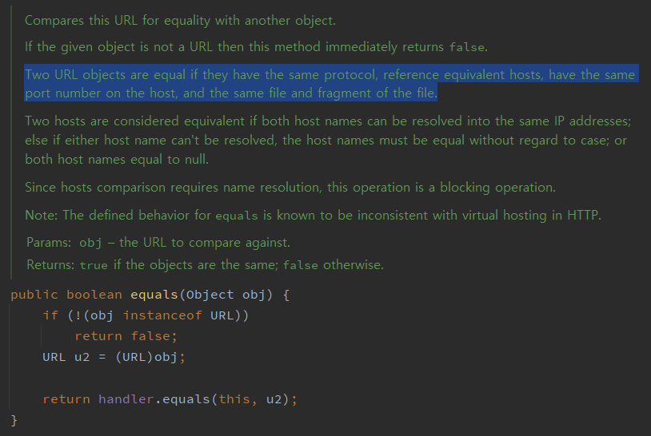

<h1>item 10. equals 는 일반 규약을 지켜 재정의하라</h1>

> equals 재정의는 필요한 경우에만 재정의 한다. 오히려 잘못 정의하면 안좋은 결과를 초래   
> 재정의 할때는 일반 규약을 반드시 지킨다

  
<h4>기본적으로 Object 의 euqals는 객체 식별성 <sup>object identity</sup> 를 비교한다</h4>

- 즉 인스턴스는 자기 자신과만 같다

<h2>재정의 하지 않아도 되는 경우</h2>

- 각 인스턴스가 본질적으로 고유
    - Thread 클래스와 같이 **동작**을 표현하는 클래스
- 인스턴스의 **논리적 동치성** <sup>logical equality 혹은 equality</sup> 검사할 일이 없을 때
- 상위 클래스가 재정의한 equals 가 이미 하위 클래스에도 딱 들어 맞을 때
- 클래스가 private 이나 package-private 이고, equals 메서드를 호출할 일이 없을 때
- Enum, 싱글턴 클래스

<h2>재정의해야하는 경우</h2>

- identity 가 아닌 logical equality 를 비교해야 하는데,
- 상위 클래스가 logical equality 를 비교하도록 재정의 되어있지 않을 때
- 주로 값 클래스
    - ex. java.lang.Integer, java.lang.String
    - Enum, 싱글턴 클래스 제외 : identity 가 같으면 equality 도 같음이 보장
    - _개발자는 String 을 사용하면서 equals 로 값을 비교하려고 할 것 임_

<h3>재정의 이점</h3>

- 값을 비교하려는 프로그래머 기대 부응
- Map, Set 과 같은 컬렉션에 논리적으로 사용 가능

<h2>equals 재정의 규약 <sup>Object 명세</sup></h2>

> equals 메서드는 동치관계를 구현하며 아래를 만족한다.
> 1. 반사성 <sup>reflexivity</sup>
> 2. 대칭성 <sup>symmetry</sup>
> 3. 추이성 <sup>trasitivity</sup>
> 4. 일관성 <sup>consitency</sup>
> 5. null 아님


_동치관계 : 올바른 equals 는 같은 인스턴스 <sup>집합</sup> 간에 필드 <sup>부분집합, 원소</sup> 교환이가능해야 함_

<h3>1. 반사성<sup>reflexivity</sup></h3>

> 모든 객체는 자신과 같아야 한다.


<h3>2. 대칭성<sup>symmetry</sup></h3>

> 서로에 대한 동치여부는 같다.

<h4>대칭성 위배 예제 : 한방향으로만 작동</h4>

```java

public class CaseInSensitive {
  private final String s;
  // ...
  
  @Override
  public boolean equals(Object o) {
      if (o instanceof CaseInSensitive) {
          return s.equals(((CaseInSensitive) o).s);
      } else if (o instanceof String) {
          return s.equalsIgnoreCase((String) o);
      } else {
          return false;
      }
  }
}

```

<h3>3. 추이성<sup>trasitivity</sup></h3>

> a, b가 같고 b, c가 같으면 a, c가 같다

<h4>추이성 위배 예제 : 부모 클래스와 확장 클래스 간의 equals 비교</h4>

- ex. java.sql.Timestamp

```java
public class PointWithName extends Point {
    private final String name; // 확장

    public PointWithName(int x, int y, String name) {
        super(x, y);
        this.name = name;
    }

    @Override
    public boolean equals(Object o) {
        if (!(o instanceof PointWithName)) {
            return false;
        } else {
            return super.equals(o) && ((PointWithName) o).name.equals(name);
        }
    }
}
```

- 객체 지향 언어가 동치 관계에서 가지는 문제점
    - _**새로운 필드를 추가한 구체 클래스와 부모 클래스 간의 equals 규약을 만족시키는 방법은 없다.**_
- 리스코프 치환 원칙 <sup>Liskov Substitution Principle</sup>
- 대안 : **상속** 대신 **컴포지션** 사용
  ```java
  public static class PointWithName {
  
      
      private final Point point; // 컴포지션
  
      public PointWithName(String name, Point point) {
          // ...
          this.point = Objects.requireNonNull(point);
      }
  
      /**
       * view method
       * : 인스턴스의 인스턴스 변수를 반환하는 메서드
       * */
  
      public Point asPoint() {
          return point;
      }
  
      @Override
      public boolean equals(Object o) {
          if (!(o instanceof PointWithName)) {
              return false;
          } else {
              PointWithName pointWithName4 = (PointWithName) o;
              return pointWithName4.name.equals(((PointWithName) o).name) && pointWithName4.point.equals(((PointWithName) o).point);
          }
  
      }
  }
    ```

<h3>4. 일관성<sup>consitency</sup></h3>

> 두 인스턴스가 같다면 영원히 같다. <sup>**수정되지 않는 한**</sup>

- 불변 클래스의 경우 equal 의 결과는 앞으로 계속 같아야 함
    - 그렇게 되게 설계해야함
- 결정적 계산 <sup>deterministic</sup> : 항상 메모리에 존재하는 객체만으로 계산해야 함
    - 불변 / 가변 상관 없이 equals 에 신뢰할 수 없는 자원이 끼어들게 하면 안됨
        - ex. java.net.URL 이 **호스트** 를 포함하여 비교함

<h4>대칭성 위배 예제 : 신뢰할 수 없는 자원을 포함한 equals</h4>

<h5>java.net.URL의 호스트를 포함한 equals</h5>



<h3>5. null 아님</h3>

> Null 이 아닌 모든 객체는 Null과 같지 않다.

- instanceof 로 Null 이 아닌지 <sup>1</sup> 와 자신 타입인지<sup>2</sup> 한번에 체크


<h2>equals를 재정의 하는 방법</h2>

1. == 연산자를 이용해 입력이 자기 자신인지 확인
   - 성능 최적화
2. instaceof 연산자로 입력이 올바른 타입인지 확인
3. 입력을 올바른 타입으로 형변환
4. **핵심** 필드들을 차례대로 비교
   - 비교 비용이 싼 필드를 먼저 비교 
   - Null 이 정상으로 취급받아야하는 필드라면 Obejct.equals(obj1, obj2)로 **NPE 방지**

<h3>주의사항</h3>

- 너무 복잡하게 해결하려들지 말 것
  - 필드 간의 동치성 검사에서 종결되는 경우가 많음
  - 오히려 공격적으로 파고들다가 문제가 발생할 수도 있음
- Object 타입 외의 타입을 입력으로 받지 말 것
  - 이건 override 가 아니라 **overload**
- 재정의 메서드 작성을 **기계에 위임**
  - **AutoValue** 프레임워크 <sup>Google</sup>
  - IDE
