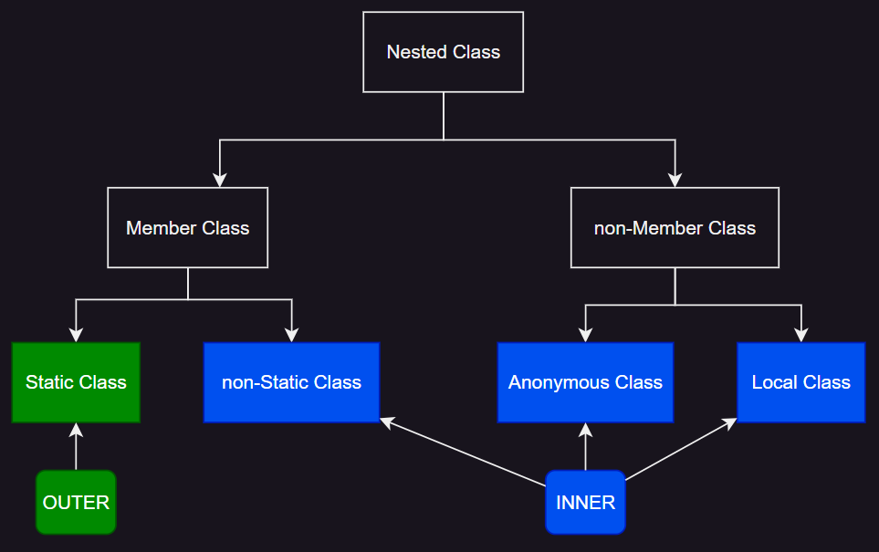
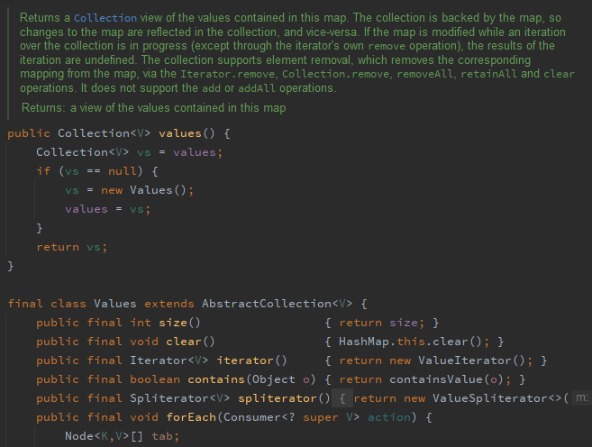

# item 24. 멤버 클래스는 되도록 static 으로 만들라

> 비정적 멤버 클래스는 숨은 참조와 메모리 누수를 일으킨다




## 중첩 클래스 <sup>nested class</sup>

- 다른 클래스 안에 정의된 클래스
- 자신을 감싼 바깥 클래스에서만 사용 가능
- **바깥 클래스 이상 범위에서 사용할 거면 톱레벨 클래스로 만들어라**

```java
public class Outer {

    public void test() {
        System.out.println("Outer");
    }

    public class Nested {
        public void test() {
            System.out.println("Nested");
        }
    }
}
```

### 중첩 클래스의 종류

- 정적 멤버 클래스
- 비정적 멤버 클래스 <sub>내부 클래스</sub>
- 익명 클래스 <sub>내부 클래스</sub>
- 지역 클래스 <sub>내부 클래스</sub>

## 정적 멤버 클래스 <sup>static member class</sup>

```java
public class Outer {

    private String outerValue = "this is outer value";

    public static class NestedStaticMember {

        public void test() {
            Outer outer = new Outer();
            System.out.println("outerValue : " + outer.outerValue); // this is outer value
        }
    }
}
```

- 클래스 내부 선언
- 바깥 클래스 private 멤버 접근 가능
- public 도우미 클래스로 쓰임
- ex. Calculator 클래스의 Operation 열거 타입

## 비정적 멤버 클래스 <sup>non-static member class, member class</sup>

```java


public class Outer {

    private String outerValue = "this is outer value";

    public void outerMethod() {
        System.out.println("this is outer Method");
    }

    public class NestedMember {
        public void test() {
            Outer outer = new Outer();
            System.out.println("outerValue : " + outer.outerValue); // this is outer value
            System.out.println("outerValue : " + Outer.this.outerValue); // this is outer value
            Outer.this.outerMethod(); // this is outer Method
        }
    }
}
```

- 정적 멤버 클래스와 의미상 차이가 큼
- 바깥 클래스 인스턴스와 암묵적으로 연결됨
- 내부 클래스의 비정규화된 this <sub>Outer.this.</sub>를 사용해 바깥 메서드, 인스턴스 참조 가능
- 내부 클래스를 바깥 클래스와 독립적으로 존재하려면 정적 멤버 클래스로 만들어야 함
    - 비정적 멤버 클래스는 바깥 인스턴스 없이 인스턴스 생성 불가

```java
Outer outer=new Outer();// 바깥 인스턴스 필요
Outer.NestedMember nestedMember1=outer.makeNestedMemberInstance(); // 일반적인 방법

Outer.NestedMember nestedMember2=new Outer().new NestedMember();  // 수동 생성 방법, 비효율적
```

### 바깥 인스턴스와의 관계

- 관계는 멤버 클래스가 인스턴스화 될 때 확립되며 수정이 불가
- 바깥 클래스의 인스턴스 메서드에서 내부 클래스의 생성자 호출시 인스턴스 생성
- 드물게 수동으로 직접 만들기도 함
    - 이는 메모리를 차지하고, 생성 시간도 좀 걸림

### 어댑터

- 비정적 멤버클래스는 주로 뷰로 쓰임
    - 뷰 : 어떤 클래스의 인스턴스를 감싸 마치 다른 클래스의 인스턴스처럼 보이게 하는 클래스



- java.util.HashMap 클래스의 values(), Values 클래스

### 멤버 클래스에서 바깥 인스턴스에 접근 안할거면 정적 멤버 클래스로 만들자

- static 생략 시 바깥 인스턴스로의 숨은 참조를 가짐
- 메모리 누수 : GC가 바깥 클래스 인스턴스의 수거를 못할 가능성 <sub>[item7](../../chapter2/item7/README.md)</sub>

## private 정적 멤버 클래스 <sup>private static member class</sup>

```java


public class Outer {

    private String outerValue = "this is outer value";

    private static class NestedStaticPrivateMember {
        public void test() {
            System.out.println("i'll not use outer value!");

            Outer outer = new Outer();
            System.out.println("outerValue : " + outer.outerValue); // 가능은 함
        }
    }
}

```

- 구성요소 : 바깥 클래스가 표현하는 객체의 한 부분을 표현하는 용도
- ex. Map의 Entry Interface
- Map 구현체는 키-값 표현을 위해 엔트리 객체를 사용
- 그러나 엔트리의 메서드들이 맵을 직접 사용하지는 않음

## 공개 API의 static 멤버 클래스

- 멤버 클래스가 공개된 클래스의 public or protected 멤버라면
- static, non-static이 더 중요
- **추후 static 키워드를 수정하면 하위 호환성이 깨짐**

## 익명 클래스 <sup>anonymous class</sup>

```java
public class Outer {
    private String outerValue = "this is outer value";

    void testAnonymousClass() {
        // 익명 클래스
        new AnonymousInterface() {
            @Override
            public void doSomething() {
                System.out.println("this is anonymous class");
                System.out.println("outerValue : " + outerValue); // this is outer value
            }
        };
    }

    public interface AnonymousInterface {
        void doSomething();
    }
}

```

- 이름이 없는 클래스
- 선언과 동시에 인스턴스 생성
- 정적이지 않은 문맥에서만 바깥 클래스 인스턴스 참조 가능
- 정적 팩터리 메서드 구현 시 사용
- 응용에 많은 제약
    - 선언 시점에만 인스턴스 생성 가능
    - instanceof 검사, 클래스 명이 필요한 작업 불가
    - 인터페이스 다중 상속 불가, 클래스 상속 불가
    - 클라이언트는 익명 클래스가 상위 타입에서 상속한 멤버 외에 호출 불가
    - 클라이언트 표현식 중간에 등장하여 가독성 떨어짐 (익명 클래스 내부 표현이 길어질 경우)
    - 람다 표현식으로 대체 가능

## 지역 클래스 <sup>local class</sup>

```java
public class Outer {
    private String outerValue = "this is outer value";

    class Inner {
        public void test() {
            System.out.println("Inner");
        }
    }
}

```

- 중첩 클래스 중 가장 드묾
- 지역 변수를 선언할 수 있는 어디서든 선언이 가능
- 유혀범위도 지역변수와 같음
- 멤버 클래스처럼 이름이 있고 반복 사용
- 익명 클래스처럼 비정적 문맥에서만 바깥 인스턴스 참조 가능, 정적 멤버 못가짐, 가독성을 위해 짧게 작성

## 정리

- 멤버 클래스 : 메서드 밖에서 사용할 예정이거나, 메서드 안에 정의하기 애매할 때
    - non-static : 멤버 클래스가 바깥 인스턴스를 참조할 때
- 익명 클래스 : 메서드 안에서만 쓰이고, 인스턴스 생성 시점이 한 곳이고, 해당 타입으로의 클래스나 인터페이스가 이미 있을 때
    - 아니면 지역 클래스

## 참고

- [The Java™ Tutorials > Nested Classes](https://docs.oracle.com/javase/tutorial/java/javaOO/nested.html)
