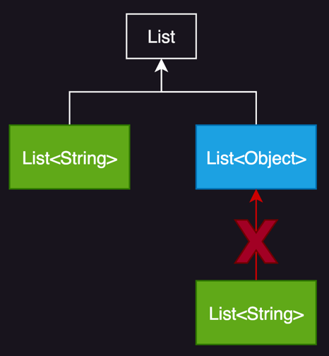

# item 26. 로 타입은 사용하지 말라

> 로타입은 타입이 안정하지 않아, 런타임 예외를 발생시킬 위험이 있다. unbounded wildcard type이나 Object타입을 사용하라

---

## Raw Type 이란?

- 제네릭 타입에서 타입 매개변수를 전혀 사용하지 않을 때
- ex. `List<E>`에서 E를 사용하지 않을 때, `List`를 Raw type이라고 함

```java
// raw type
private final Collection stamps=...;

// 실수로 coin 도 stamps에 넣을 수 있음
        stamps.add(new Coin(...)); // compile warning : unchecked call to add(E) as a member of raw type Collection

// 클라이언트가 꺼낼 때 ClassCastException 발생
        for(Iterator i=stamps.iterator();i.hasNext();){
        Stamp stamp=(Stamp)i.next(); // ClassCastException
        stamp.cancel();
        }
```

### Raw type의 단점

- 제네릭이 주는 안정성과 표현력을 모두 잃음
- Raw type은 java 5 이전의 코드들과의 호환성 때문에 탄생
    - java 5 이전의 코드는 제네릭이 없기 때문에 raw type을 사용해야 함
    - 대신 erasure<sup>소거 TODO.item26</sup> 사용

## 제네릭으로 raw type 개선

```java
// 제네릭 type
private final Collection<Stamp> stamps=...;

// 컴파일 에러
        stamps.add(new Coin(...)); // compile error : incompatible types: Coin cannot be converted to Stamp
```

- 컴파일러가 원소를 꺼내는 모든 곳에 형변환 추가

## List vs List\<Object>

- `List` 는 제네릭의 규칙에서 전혀 배제
- `List<Object>`는 모든 타입의 객체를 저장할 수 있음
- Raw type을 사용하면 타입 안정성이 깨짐



```java
public class Item26 {
    public static void main(String[] args) {

        List<String> strings = new ArrayList<>();
        unsafeAdd(strings, Integer.valueOf(42));
        unsafeAdd(strings, "42");

        /**
         * 컴파일러가 자동 형변환 코드를 넣음
         * java.lang.ClassCastException: class java.lang.Integer cannot be cast to class java.lang.String
         * */
        String s = strings.get(0);
    }

    private static void unsafeAdd(List list, Object val) { // compile warning : Raw use of parameterized class 'List'
        list.add(val);
    }
}
```

```java

public class Item26 {
    public static void main(String[] args) {

        List<String> strings = new ArrayList<>();

        safeAdd(strings, Integer.valueOf(42)); // compile error : incompatible types: java.util.List<java.lang.String> cannot be converted to java.util.List<java.lang.Object>
    }

    private static void safeAdd(List<Object> list, Object val) { // compile warning : Raw use of parameterized class 'List'
        list.add(val);
    }
}

```

## Raw type 대체 : unbounded wildcard type <sup>비한정적 와일드카드 타입</sup>

- Raw type에는 어떤 타입의 원소든 넣을 수 있어 타입 안정성이 없음
- unbounded wildcard type : `List<?>`
- 타입 안정성을 지키면서 유연성을 얻을 수 있음

```java
private static int numElementInCommon(Set s1, Set s2) {
    int result = 0;
    for (Object o1 : s1) {
        if (s2.contains(o1)) {
            result++;
        }
    }
    return result;
}
```

```java
private static int numElementInCommon(Set<?> s1, Set<?> s2) {
    int result = 0;
    for (Object o1 : s1) {
        if (s2.contains(o1)) {
            result++;
        }
    }
    return result;
}
```

### unbounded wildcard type에는 null 외에는 어떤 원소도 넣을 수 없음

- 제네릭 메서드, 한정적 와일드카드로 극복 가능

```java
Set<?> set1 = Set.of(1, 2, 3);
set1.add(null);
set1.add(1.9); // compile error : incompatible types: java.lang.Double cannot be converted to capture#1 of ?
set1.add(2); // incompatible types: int cannot be converted to capture#2 of ?
```

## Raw Type의 용도

```java
private static void checkInstanceOfSet(Object o ){
    if(o instanceof Set){
      Set<?> set = (Set<?>) o;
      // ...
    }
}
```

- class literal
  - 자바 명세가 class literal에 매개변수화 타입 사용 금지 
  - ex. `List.class`, `String[].class`, `int.class`
- instanceof 연산자
  - 런타임에는 제네릭 정보가 지워짐
  - instanceof에 대해서 로타입과 unbounded wildcard type은 동일하게 동작
  - 제네릭타입은 코드만 지져분해짐